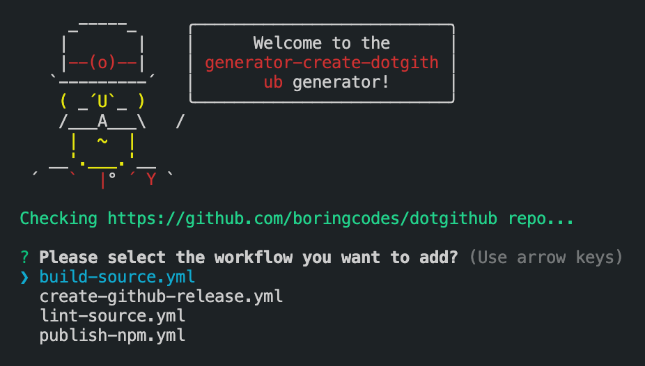

<div align="center">
  <h1>create-dotgithub</h1>
  <p>Boring GitHub Dotfiles Generator (templates fetched from <a href="https://github.com/boringcodes/.github">boringcodes/.github</a>)</p>

  <p>
    <a href="https://github.com/boringcodes/create-dotgithub/commits" aria-label="Commitizen Friendly">
      
    </a>
    <a href="https://github.com/boringcodes/create-dotgithub" aria-label="Prettier Code Style">
      
    </a>
    <a href="https://github.com/boringcodes/create-dotgithub/actions" aria-label="Lint Status">
      
    </a>
    <a href="https://david-dm.org/boringcodes/create-dotgithub" aria-label="Dependencies Status">
      
    </a>
    <a href="https://www.npmjs.com/package/generator-create-dotgithub" aria-label="NPM Version">
      
    </a>
    <a href="https://www.npmjs.com/package/generator-create-dotgithub" aria-label="NPM Downloads">
      
    </a>
    <a href="https://github.com/boringcodes/create-dotgithub/blob/master/LICENSE" aria-label="MIT License">
      
    </a>
    <a href="https://github.com/boringcodes" aria-label="BoringCodes Verified">
      
    </a>
  </p>

  
</div>

## Features

Supported features:

- [x] **Workflows**
- [ ] **Actions**

Workflows grouped by steps:

- Test
  - [x] **lint-source.yml**: check code style & quality
  - [ ] **test.yml**: run unit test
- Build
  - [x] **build-source.yml**: build source
  - [x] **build-image.yml**: build Docker image
- Push
  - [x] **create-github-release.yml**: create GitHub Release
  - [x] **publish-npm.yml**: publish source to NPM Registry
  - [x] **push-dockerhub.yml**: push Docker image to DockerHub
- Deploy
  - [x] **deploy-cloudflare-workers.yml**: deploy source to CloudFlare Workers

## Install

Make sure `yeoman` is installed

```sh
$ yarn global add yo
```

Then install the generator

```sh
$ yarn global add generator-create-dotgithub
```

## Usage

Then navigate to the root directory and run the following command to generate source

```sh
$ yo create-dotgithub
```

This scaffolds out

```
├── .github
│   └── actions
│   │   └── generated-action.yml
│   └── workflows
│       └── generated-workflow.yml
└── ...
```

## Contributing

Pull requests are welcome. For major changes, please open an issue first to discuss what you would like to change.

Please make sure to update tests as appropriate.

## Authors

[BoringCodes](https://github.com/boringcodes)

## License

[MIT](https://github.com/boringcodes/create-dotgithub/blob/master/LICENSE)
